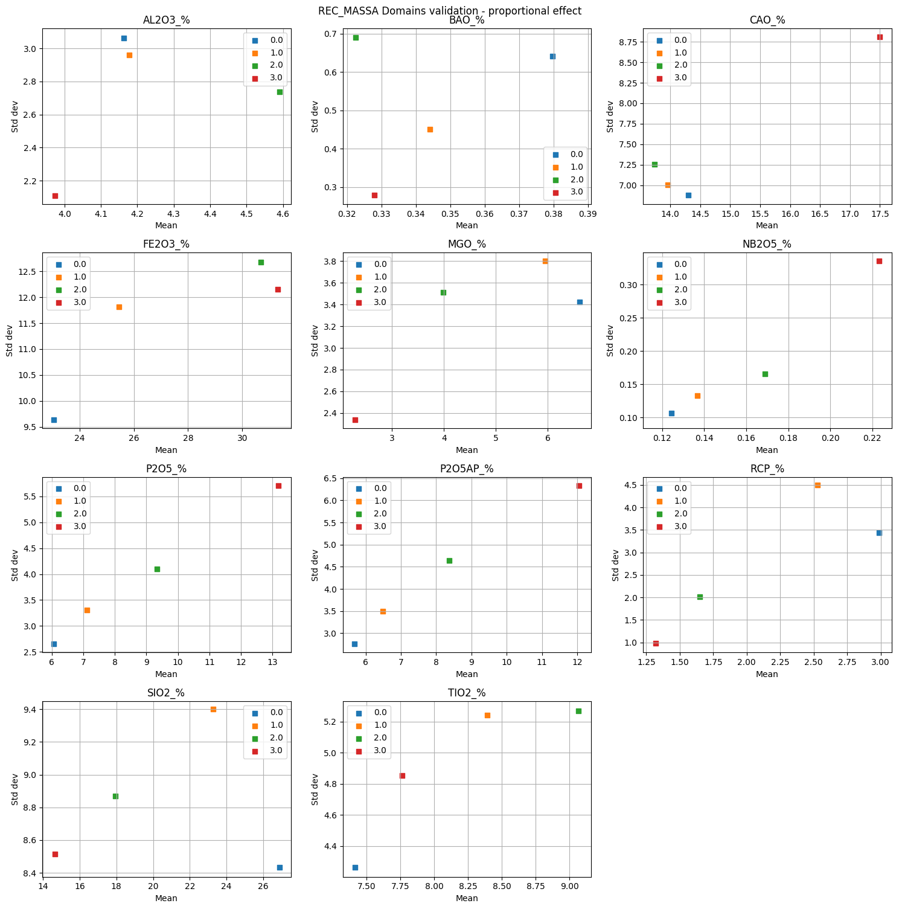

# GV-helpers

Helpers modules for isatis.neo.

## Instructions

Add the code below to your calculator initialization script.

    if app[ 'project_batch_path' ] not in sys.path: 
        sys.path.append(app[ 'project_batch_path'])

Then, import the desired module as shown below. The file must be in the same folder as the batch file.

    import DDH_BH_analysis

### boxplots

Boxplots for a list of variables per domains.

### ca1_in_cat2

Plots bar graph given two categorical variables.

### confusion matrix

A simple confusion matrix.

### corr_to_target

PLots scatterplots of a series of variables in respect to a target colored by a categorical variable.

### DDH_BH_analysys

Plots a DDH vs BH analysis given two arrays of twin samples.

### outliers_helpers

Functions to help identifying outliers.

### PCA_analysis

Plots to help PCA analysis.

### proportional_effect

Plots proportional effect per domain.

### SVC_smoothing_calibration

Reference: Cevik, I.S., Leuangthong, O., Caté, A. et al. On the Use of Machine Learning for Mineral Resource Classification. Mining, Metallurgy & Exploration 38, 2055–2073 (2021). https://doi.org/10.1007/s42461-021-00478-9

